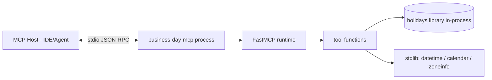
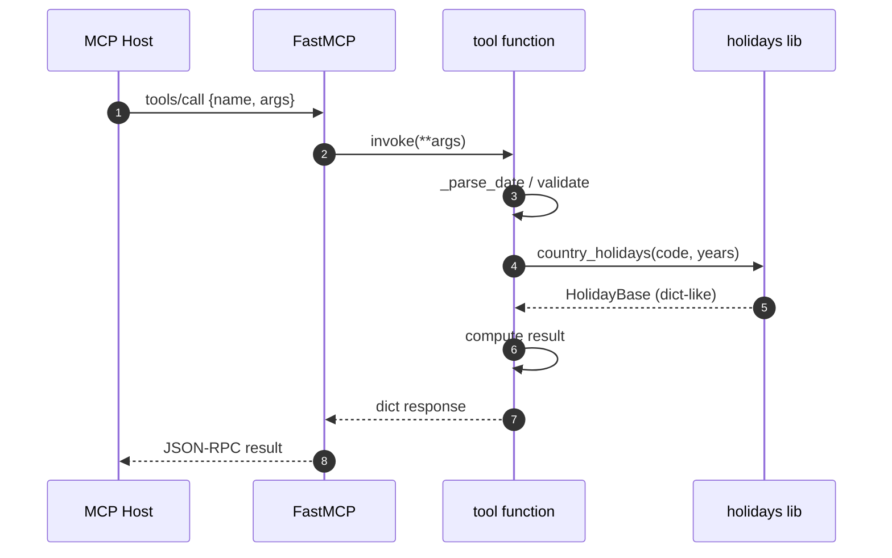

# Architecture

<!-- metadata: scope=architecture, audience=ai-assistants, topic=design-principles -->

## System View

`business-day-mcp` is a single-process MCP (Model Context Protocol) server that runs over stdio. A host (IDE, chat client, or agent runtime) launches it as a subprocess, and JSON-RPC messages flow over stdin/stdout. There is no network listener, no database, no filesystem state.

## Module Boundary

There is exactly one module of substance: `business_day_mcp.server`. It contains:

- The `FastMCP` app instance (`mcp = FastMCP("business-day-mcp")`).
- Eight public tool functions, each registered via `mcp.tool(<fn>)` after its definition.
- Private helpers (`_parse_date`, `_get_country_holidays`, `_is_weekend`, `_is_business_day`, `_step_business_day`, `_country_display_name`).
- The entry point `main()` which calls `mcp.run()`.

`__init__.py` re-exports `main` and `mcp`. `__main__.py` enables `python -m business_day_mcp`. The `business-day-mcp` console script (defined in `pyproject.toml`) points at `server:main`.

## Design Principles

### 1. Thin wrapper over `holidays`

All country-specific knowledge lives in the third-party `holidays` library. This repo contributes:

- A stable MCP tool surface with strict input validation.
- Weekend handling (Sat/Sun as non-business days — no per-country weekend override).
- Date/range arithmetic not provided by `holidays` directly.

When `holidays` adds or fixes a country, this server picks it up on the next dependency bump with no code change.

### 2. Stateless (Principle #10)

No in-process cache of holiday objects. `holidays.country_holidays(code, years=...)` is called fresh on every tool invocation. This is **intentional and enforced by a test** (`tests/test_statelessness.py`).

Rationale:

- Trivially correct across year boundaries (each call computes the exact year window it needs).
- Safe for long-running MCP sessions: no stale data if the `holidays` package is updated mid-process (unlikely, but free).
- Simpler code; no cache invalidation.
- The cost (a small object allocation per call) is negligible compared to JSON-RPC overhead.

Do not add memoization / LRU caches without removing the statelessness test.

### 3. Safety guards against pathological input (SR-F4)

Two constants at the top of `server.py` cap iteration:

| Constant | Value | Enforced in |
|----------|-------|-------------|
| `_MAX_SPAN_YEARS` | `100` | `business_days_between` (rejects `end.year - start.year > 100`) |
| `_MAX_STEP_ITERATIONS` | `3650` (~10 years) | `_step_business_day` loop (protects `next_business_day` / `previous_business_day`) |

Both raise `ValueError` with a clear message on breach.

### 4. Case-insensitive country input

Users pass `"de"`, `"DE"`, or `"De"` — `_get_country_holidays` calls `.upper()` before lookup. All responses echo the normalized uppercase code.

### 5. Fail loudly on bad input

Every parsing/validation error surfaces as a `ValueError` with an actionable message (e.g., "Unknown country code: XX. Use get_supported_countries to see available codes."). There are no silent defaults or empty-result fallbacks.

## Dispatch Flow

## Error Model

All validation errors are `ValueError`. FastMCP serializes raised exceptions as MCP tool errors. No custom exception hierarchy is defined in this repo.

## What Is Deliberately Absent

- No configuration file, no env vars, no flags.
- No persistence (cache, SQLite, disk).
- No logging framework wired up (FastMCP handles protocol-level logging).
- No async tools — all tool functions are sync; FastMCP handles the event loop.
- No per-country weekend customization (Friday/Saturday weekend regions are treated as Sat/Sun by design).
