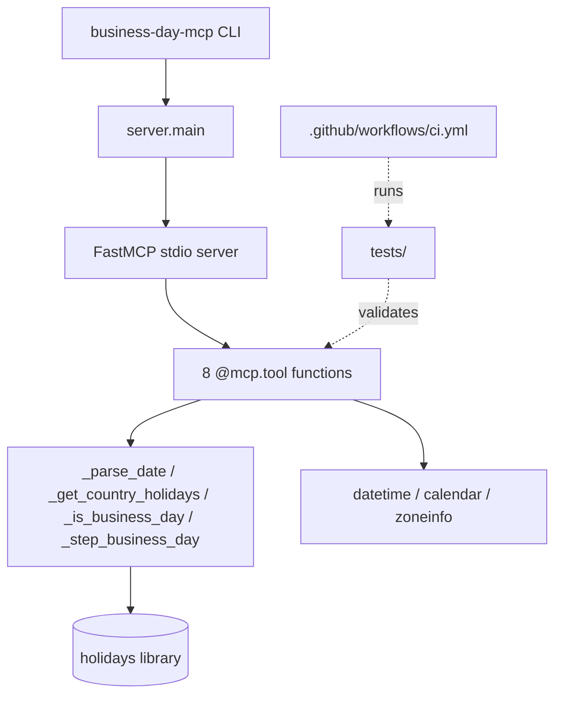

# Codebase Information

<!-- metadata: scope=overview, audience=ai-assistants, topic=project-snapshot -->

## Project Identity

- **Name**: `business-day-mcp`
- **Version**: 0.1.0 (Development Status: Beta)
- **License**: MIT
- **Language**: Python (requires-python `>=3.10`; CI matrix: 3.10, 3.11, 3.12, 3.13)
- **Distribution**: PyPI package installed with `uvx business-day-mcp` or `pip install business-day-mcp`
- **Entry point (CLI)**: `business-day-mcp` script → `business_day_mcp.server:main`
- **Purpose**: Model Context Protocol (MCP) server exposing business-day/holiday arithmetic tools with country-aware calendars.

## Top-Level Layout

```
business-day-mcp/
├── src/business_day_mcp/     # Python package (server + entry points)
│   ├── server.py             # All MCP tool definitions + helpers
│   ├── __init__.py           # Re-exports `main`, `mcp`, `__version__`
│   └── __main__.py           # `python -m business_day_mcp` shim
├── tests/                    # pytest suites (one file per concern)
├── .github/workflows/        # CI (ci.yml) + release (publish.yml)
├── dist/                     # Built wheels/sdists (gitignored content)
├── pyproject.toml            # Build, deps, tool config (ruff/mypy/pytest/bandit/coverage)
├── .pre-commit-config.yaml   # Pre-commit hooks (ruff, mypy, bandit, detect-secrets)
├── .secrets.baseline         # detect-secrets baseline
├── uv.lock                   # Locked dependency graph (uv)
├── README.md                 # User-facing install and config
└── LICENSE                   # MIT
```

## Structure Diagram



## Technology Stack

| Layer | Technology |
|-------|------------|
| Runtime | Python 3.10+ |
| MCP framework | `fastmcp >=2.12,<3` |
| Holiday calendars | `holidays >=0.50` |
| Build backend | `hatchling` |
| Package manager | `uv` |
| Linter + formatter | `ruff` (rules: E, F, W, I, B, UP, S, C90, SIM, RUF; line-length 100; mccabe max-complexity 10) |
| Type checker | `mypy` strict mode (src only) |
| Security | `bandit`, `pip-audit`, `detect-secrets` |
| Tests | `pytest` + `pytest-cov` (fail-under 90%, branch coverage) |
| Pre-commit | `pre-commit` (ruff, mypy, bandit, detect-secrets, whitespace/yaml/toml hooks) |
| CI/CD | GitHub Actions (`actions/setup-python`, `astral-sh/setup-uv`); PyPI Trusted Publisher |

## Exposed MCP Tools (8)

Registered via `mcp.tool(<fn>)` in `server.py`:

1. `is_business_day(date, country)`
2. `get_current_date(timezone="UTC")`
3. `next_business_day(date, country, inclusive=False)`
4. `previous_business_day(date, country, inclusive=False)`
5. `last_business_day_of_month(year, month, country)`
6. `business_days_between(start_date, end_date, country, inclusive=False)`
7. `list_holidays(year, country)`
8. `get_supported_countries()`

All tools are read-only, return JSON-serializable `dict[str, Any]`, and raise `ValueError` for invalid input.

## Conventions (Hard Rules in Code)

- **Dates**: ISO 8601 `YYYY-MM-DD` strings — parsed via `datetime.date.fromisoformat`.
- **Country codes**: ISO 3166-1 alpha-2, normalized with `.upper()` (input is case-insensitive).
- **Timezones**: IANA names resolved via `zoneinfo.ZoneInfo`.
- **Weekend**: `weekday() >= 5` (Sat/Sun). There is no per-country weekend override.
- **Business day**: not a weekend AND not a holiday for the given country-year.

## Safety / DoS Guards

Defined in `server.py` (referenced as SR-F4):

- `_MAX_SPAN_YEARS = 100` — caps `business_days_between` range.
- `_MAX_STEP_ITERATIONS = 3650` (~10 years) — caps `_step_business_day` loops.

## Stateless Design (Principle #10)

- No in-process caching of holiday objects.
- `holidays.country_holidays()` is invoked fresh on every tool call.
- Enforced by `tests/test_statelessness.py` (monkeypatch spy ensures ≥2 calls across 2 invocations).

## Test Organization

| File | Concern |
|------|---------|
| `test_basic_tools.py` | `is_business_day`, `get_current_date` |
| `test_navigation.py` | `next_business_day`, `previous_business_day` |
| `test_aggregates.py` | `business_days_between`, `last_business_day_of_month` |
| `test_metadata.py` | `list_holidays`, `get_supported_countries` |
| `test_edge_cases.py` | Timezone edges, US/DE holiday-on-weekend observance |
| `test_case_insensitive_country.py` | `.upper()` normalization behavior |
| `test_statelessness.py` | Principle #10: no caching |
| `conftest.py` | Shared fixtures with documented DE/US 2026 reference dates |

## CI Pipeline (`.github/workflows/ci.yml`)

Jobs run on push to `main` and on PRs:

1. **lint** — `ruff check` + `ruff format --check`
2. **typecheck** — `mypy src`
3. **security** — `bandit`, `pip-audit --strict`, `detect-secrets scan --baseline`
4. **test** — `pytest --cov` across Python 3.10/3.11/3.12/3.13
5. **build** (needs all above) — `uv build` + `twine check`

## Release Pipeline (`.github/workflows/publish.yml`)

Triggered on tag push `v*.*.*`:

- Builds artifacts.
- Publishes to PyPI via **OIDC Trusted Publisher** (no API token; requires one-time PyPI setup pointing at the GitHub repo).
- Creates GitHub Release with auto-generated notes.
