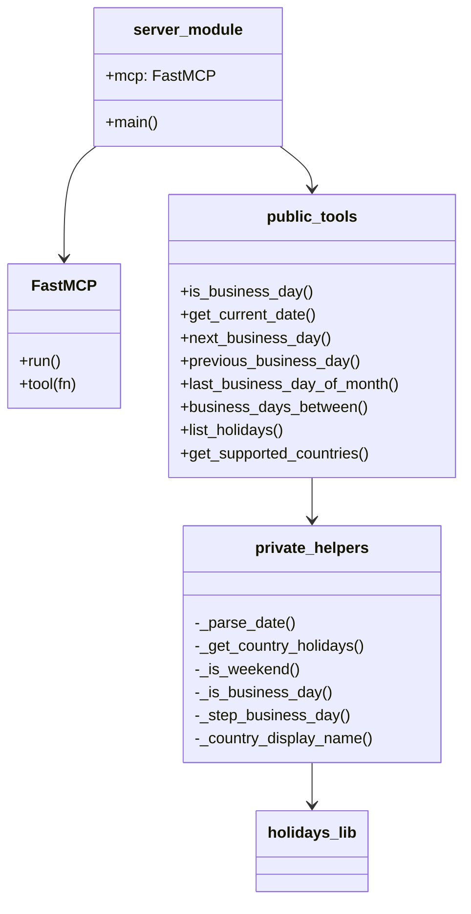

# Components

<!-- metadata: scope=components, audience=ai-assistants, topic=module-responsibilities -->

All runtime behavior lives in `src/business_day_mcp/server.py`. This file documents each function's role, inputs/outputs, and cross-references.

## Module: `business_day_mcp.server`

### App Instance

```python
mcp = FastMCP("business-day-mcp")
```

Single global `FastMCP` instance. The server name `"business-day-mcp"` is what clients see in the MCP handshake.

### Constants

| Name | Value | Purpose |
|------|-------|---------|
| `_MAX_SPAN_YEARS` | `100` | Reject ranges wider than 100 years in `business_days_between`. |
| `_MAX_STEP_ITERATIONS` | `3650` | Abort `_step_business_day` loop after ~10 years of stepping. |

### Tool registration pattern

Each public function is defined, then registered:

```python
def is_business_day(...): ...
mcp.tool(is_business_day)
```

Registration happens at import time via module-level `mcp.tool(fn)` calls. The decorator syntax (`@mcp.tool`) is NOT used in this codebase — preserve the imperative style when adding tools. Registration order currently is: `is_business_day` is registered inline after its definition; the remaining seven are registered in a block near the end of the file.

### Private Helpers

#### `_parse_date(date_str) -> datetime.date`

Thin wrapper around `datetime.date.fromisoformat`. Re-raises `ValueError`/`TypeError` as a `ValueError` with the offending string and the expected format hint.

#### `_get_country_holidays(country, years) -> holidays.HolidayBase`

- Upper-cases the country code.
- Calls `holidays.country_holidays(code, years=...)`.
- Converts `NotImplementedError` (unknown country) to `ValueError` that points the user at `get_supported_countries`.
- `years` may be an int or a list of ints (used by `business_days_between` for multi-year spans).

#### `_is_weekend(d) -> bool`

`d.weekday() >= 5`. Saturday and Sunday only; there is no per-country override.

#### `_is_business_day(d, country_holidays) -> bool`

`not weekend and d not in country_holidays`. The `in` check uses `HolidayBase.__contains__`, which is date-keyed.

#### `_step_business_day(date, country, inclusive, step) -> (original_date, business_day, skipped)`

Iterative walker shared by `next_business_day` (step=+1) and `previous_business_day` (step=-1).

- If `inclusive=True` and the input is already a business day, returns it immediately (`skipped=0`).
- If `inclusive=False`, always moves at least one day before checking.
- Loop exits once `_is_business_day` returns `True`.
- Raises `ValueError` if the loop exceeds `_MAX_STEP_ITERATIONS`.

#### `_country_display_name(code) -> str`

Reflection helper for `get_supported_countries`. Walks the `holidays` package attribute tree:

1. `getattr(holidays, code)` → country class (e.g., `holidays.DE`).
2. Prefer `cls.country_name` if present.
3. Fallback: first non-empty line of `cls.__doc__`.
4. Final fallback: return the code itself.

This is the only place that introspects the `holidays` library beyond `country_holidays`/`list_supported_countries`.

### Public Tools

See `interfaces.md` for signatures and return shapes. Responsibilities at a glance:

| Function | Role |
|----------|------|
| `is_business_day` | Single-date check; returns weekend/holiday flags plus holiday name. |
| `get_current_date` | Clock read for the caller's IANA timezone. Only stdlib; no holiday computation. |
| `next_business_day` | Forward walk via `_step_business_day(step=+1)`. |
| `previous_business_day` | Backward walk via `_step_business_day(step=-1)`. |
| `last_business_day_of_month` | Starts from `calendar.monthrange(...)[1]` and walks backward one day at a time. |
| `business_days_between` | Day-by-day sweep of the inclusive/exclusive range, counting business days and collecting weekday holidays. |
| `list_holidays` | Sorted list of all holidays for a year+country. |
| `get_supported_countries` | Enumerates `holidays.utils.list_supported_countries(include_aliases=False)` and resolves display names. |

### Entry Point

```python
def main() -> None:
    mcp.run()
```

`mcp.run()` picks stdio transport by default. The `business-day-mcp` console script (declared in `pyproject.toml → [project.scripts]`) points here.

## Package-Level Files

### `src/business_day_mcp/__init__.py`

- Sets `__version__ = "0.1.0"`.
- Re-exports `main` and `mcp` from `server`.
- `__all__ = ["__version__", "main", "mcp"]`.

Note: `__version__` is currently hard-coded here AND in `pyproject.toml`. Keep both in sync on release.

### `src/business_day_mcp/__main__.py`

Three-line shim that lets `python -m business_day_mcp` invoke `main()`.

## Tests

### `tests/conftest.py`

Exposes reference-date fixtures for the German 2026 calendar plus US. The docstring block lists every reference date and its category, so tests remain self-explanatory:

- `de_business_day`, `de_holiday`, `de_weekend`
- `us_business_day`, `us_holiday`

Prefer extending fixtures here rather than hardcoding dates in new tests.

### Test files

See `codebase_info.md` → "Test Organization" for the one-file-per-concern mapping. Two test files merit special attention:

- `test_statelessness.py` — **DO NOT delete or weaken without removing the caching claim in `architecture.md`.** It monkeypatches `holidays.country_holidays` with a call-counting spy and asserts the count grows with invocations.
- `test_edge_cases.py` — covers US July 4 weekend observance, German Unity Day on Saturday, Ascension Day (Thursday, movable feast), and Asia/Tokyo timezone edge cases. Extend this file when adding country-specific edge-case coverage.

## Component Diagram


