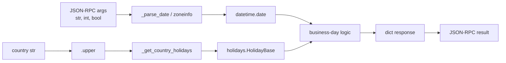

# Data Models

<!-- metadata: scope=data-models, audience=ai-assistants, topic=types-and-shapes -->

This codebase does not define classes or dataclasses. All data flowing across boundaries is either a primitive, a `datetime.date`, or a plain `dict[str, Any]` assembled inline in each tool. Type hints are `dict[str, Any]` at the tool boundary; stricter shapes live in test assertions.

## Internal Types

### `datetime.date`

Every tool parses incoming date strings into `datetime.date` via `_parse_date`. Internal arithmetic uses `datetime.timedelta(days=...)`. Dates are serialized back to ISO with `.isoformat()`.

### `datetime.datetime` (tz-aware)

Used only in `get_current_date`:

```python
now = datetime.datetime.now(tz=zoneinfo.ZoneInfo(timezone))
```

Never stored or returned — only `now.date().isoformat()`, `now.strftime("%A")`, and `now.isocalendar().week` are returned.

### `holidays.HolidayBase`

The `holidays` library returns a dict-like object keyed by `datetime.date` with string values (the localized holiday name). It supports `in`, `.get(d)`, iteration (`.items()`), and multi-year windows via `years=[2025, 2026, ...]`.

`_get_country_holidays` is the only place that constructs one.

## Response Shapes (per tool)

| Tool | Response keys |
|------|---------------|
| `is_business_day` | `date`, `country`, `is_business_day`, `is_weekend`, `is_holiday`, `holiday_name` |
| `get_current_date` | `date`, `timezone`, `day_of_week`, `iso_week` |
| `next_business_day` | `input_date`, `next_business_day`, `country`, `skipped_days` |
| `previous_business_day` | `input_date`, `previous_business_day`, `country`, `skipped_days` |
| `last_business_day_of_month` | `year`, `month`, `country`, `last_business_day`, `last_calendar_day` |
| `business_days_between` | `start_date`, `end_date`, `country`, `inclusive`, `business_days`, `calendar_days`, `holidays_in_range` |
| `list_holidays` | `year`, `country`, `holidays` |
| `get_supported_countries` | `countries`, `total` |

### Nested shapes

**`business_days_between.holidays_in_range` item**

```json
{"date": "YYYY-MM-DD", "name": "Holiday name"}
```

Includes only weekday holidays (Mon–Fri). Weekend holidays are filtered out.

**`list_holidays.holidays` item**

```json
{"date": "YYYY-MM-DD", "name": "Holiday name"}
```

Sorted ascending by date.

**`get_supported_countries.countries` item**

```json
{"code": "DE", "name": "Germany"}
```

Sorted ascending by `code`.

## Field Semantics

| Field | Meaning |
|-------|---------|
| `date` / `input_date` / `start_date` / `end_date` | ISO 8601 date string, echoed back so the client can correlate requests. |
| `country` | Upper-cased ISO 3166-1 alpha-2 code (normalized from any input case). |
| `is_business_day` | `not weekend and not holiday`. |
| `is_weekend` | True for Saturday and Sunday only (no per-country override). |
| `is_holiday` | True iff the date has an entry in the country's `HolidayBase` for that year. |
| `holiday_name` | The entry's value from `HolidayBase`, or `null` when absent. |
| `skipped_days` | Days stepped over while seeking the next/previous business day (includes weekends and holidays). |
| `last_business_day` vs `last_calendar_day` | The latter is always `calendar.monthrange(year, month)[1]`; the former walks back from it. They are equal when the month ends on a business day. |
| `business_days` | Count of weekday, non-holiday dates in the iteration window. |
| `calendar_days` | `(end - start).days + (1 if inclusive else 0)`. |
| `inclusive` | Echoed back so clients know which window semantics were used. |
| `total` | `len(countries)` — changes when `holidays` upgrades. |

## Why plain dicts (no Pydantic / TypedDict)

- FastMCP handles JSON serialization of `dict[str, Any]` natively.
- The tool surface is small and stable; the overhead of model classes was not worth the coupling.
- Strict `mypy` still catches missing keys at the call sites.

If a future change needs stricter schemas (e.g., tool description auto-generation), introduce `TypedDict`s per tool response rather than runtime validators — that keeps the zero-cost serialization.

## Data Flow Diagram


