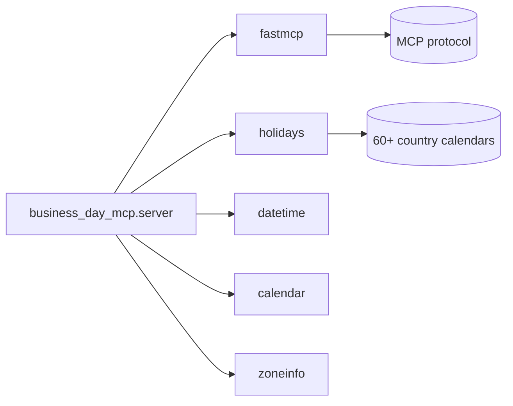

# Dependencies

<!-- metadata: scope=dependencies, audience=ai-assistants, topic=external-packages -->

## Runtime Dependencies

Declared in `pyproject.toml → [project].dependencies`. Resolved and locked in `uv.lock`.

### `fastmcp >=2.12,<3`

- MCP framework providing the `FastMCP` server class, the `tool(fn)` registration, JSON-RPC over stdio, and exception → MCP-error serialization.
- Upper-bound pinned to `<3` because FastMCP follows semver and a major bump may change the tool-registration API. Review the changelog before relaxing.
- Imported in `server.py` as `from fastmcp import FastMCP`.

### `holidays >=0.50`

- Provides `country_holidays(code, years=...)`, `HolidayBase` (dict-like, date-keyed), `utils.list_supported_countries(include_aliases=False)`, and per-country classes (`holidays.DE`, `holidays.US`, …) used by `_country_display_name`.
- The entire country/holiday knowledge of this server comes from this dependency. Bumping it picks up new countries and corrections automatically.
- Lower bound `>=0.50` is the version that stabilized the APIs the server depends on. No upper bound — breaking changes in this library have historically been rare and caught by tests.

## Runtime Stdlib Use

No external runtime dependency is used for the following; they are called from the Python stdlib:

| Module | Use |
|--------|-----|
| `datetime` | `date`, `datetime.now`, `timedelta`, `fromisoformat`, `isoformat`, `strftime`, `isocalendar` |
| `calendar` | `monthrange` for `last_business_day_of_month` |
| `zoneinfo` | IANA timezone resolution in `get_current_date` (requires Python 3.9+, fine for 3.10 floor) |
| `typing` | `Any` in signatures |

## Dev Dependencies

Declared in `pyproject.toml → [project.optional-dependencies].dev`. Installed by `uv sync --all-extras`.

| Package | Role |
|---------|------|
| `pytest >=7.0` | Test runner. Config in `[tool.pytest.ini_options]`. |
| `pytest-cov >=4.0` | Coverage collection; fail-under 90%, branch coverage. Config in `[tool.coverage.run]` and `[tool.coverage.report]`. |
| `ruff >=0.6` | Lint + format. Selected rule groups: E, F, W, I, B, UP, S, C90, SIM, RUF. McCabe max-complexity 10. Line length 100. Tests exempt from `S101` (assert) and `S311` (pseudo-random). |
| `mypy >=1.11` | Strict type checking on `src/`. `ignore_missing_imports = true` to tolerate partial stubs from `fastmcp`/`holidays`. |
| `bandit[toml] >=1.7` | Python security lints. `exclude_dirs = ["tests"]`. Config in `[tool.bandit]`. |
| `pip-audit >=2.7` | CVE scan on resolved dependencies. Run with `--strict` in CI. |
| `detect-secrets >=1.5` | Baseline-driven secret scan. Baseline stored in `.secrets.baseline`. |
| `pre-commit >=3.8` | Orchestrates local hooks defined in `.pre-commit-config.yaml`. |

## CI / Release Dependencies (GitHub Actions)

Not pinned in `pyproject.toml` but worth knowing:

| Action | Role |
|--------|------|
| `actions/checkout@v4` | Source checkout. |
| `astral-sh/setup-uv@v3` | Installs `uv`, enables cache. |
| `actions/setup-python@v5` | Matrix Python version (test job). |
| `actions/upload-artifact@v4` / `actions/download-artifact@v4` | Passing the `dist/` artifact between jobs. |
| `pypa/gh-action-pypi-publish@release/v1` | PyPI publish via OIDC Trusted Publisher. |
| `softprops/action-gh-release@v2` | Auto-creates GitHub Release with notes. |

## Dependency Graph

## Why These Versions

- `fastmcp >=2.12,<3`: 2.12 is the first release where the server name handling matches current usage; `<3` guards against unannounced API churn.
- `holidays >=0.50`: API stability threshold for `country_holidays` / `list_supported_countries`. Older versions expose slightly different kwargs.
- `ruff >=0.6`: Rule group names (`C90`, `SIM`, `RUF`) and `per-file-ignores` semantics match the config in `pyproject.toml`.
- `mypy >=1.11`: Needed for full `from __future__ import annotations` + `int | list[int]` handling under `strict = true`.
- Python `>=3.10`: `zoneinfo` stdlib (3.9+), PEP 604 union types (`int | list[int]`) used in helper signatures.
