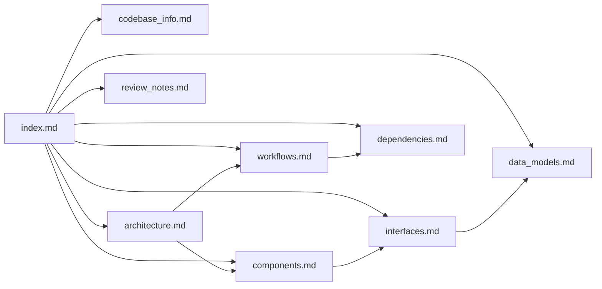

# Knowledge Base Index

<!-- metadata: scope=index, audience=ai-assistants, role=primary-context-file -->

> **For AI assistants**: Load this file first. It is the navigation map for all documentation under `.agents/summary/`. Each entry below includes a one-line purpose and the question types it answers. Open the linked file only when the user question matches its purpose — do not preload everything.

## How to Use This Index

1. Read the user question.
2. Match it to the "answers questions about…" bullet in the table below.
3. Open only the matching file(s). If the question spans multiple concerns (e.g., "how does tool X work end-to-end"), open `architecture.md` and `workflows.md`.
4. For a repo-specific fact that is not covered here (conventions, gotchas, workflow rules), check the consolidated `AGENTS.md` in the repo root — specifically its `Custom Instructions` section.

## Document Map

| File | Purpose | Answers questions about… |
|------|---------|--------------------------|
| `codebase_info.md` | Project snapshot: identity, layout, stack, tools, conventions, safety guards, stateless principle, test/CI summary. | "What is this project? What stack? What tools does it expose? What are the file-level conventions?" |
| `architecture.md` | System architecture, runtime model (stdio MCP), module boundaries, design principles (stateless, DoS-guarded, thin-wrapper-over-`holidays`). Includes component and sequence diagrams. | "How is the server wired? Why stateless? How do tools dispatch?" |
| `components.md` | Per-component responsibilities: `FastMCP` app, tool functions, private helpers, test fixtures. | "What does function X do? Which helper normalizes country codes?" |
| `interfaces.md` | MCP tool surface: each tool's signature, parameters, return shape, and error conditions. | "What does `business_days_between` return? What errors can `is_business_day` raise?" |
| `data_models.md` | Input/output shapes (dict schemas) for each tool, plus internal types (`datetime.date`, `HolidayBase`). | "What fields are in the response of tool X? What types cross the boundary?" |
| `workflows.md` | Key processes: tool invocation path, iteration algorithms, CI/release flow, local dev loop. Includes sequence diagrams. | "What happens when a client calls `next_business_day`? How does release to PyPI work?" |
| `dependencies.md` | External dependencies with exact constraints, role, and why each is pinned the way it is. | "What is `fastmcp` for? Why `holidays>=0.50`?" |
| `review_notes.md` | Consistency and completeness review output. Lists gaps and recommendations. | "What documentation is missing? Where are inconsistencies?" |

## Quick-Reference Lookup

| If the user asks about… | Go to |
|-------------------------|-------|
| Adding a new MCP tool | `components.md` → "Tool registration pattern"; `architecture.md` → "Design principles" |
| Why calls aren't cached | `architecture.md` → "Stateless design (Principle #10)"; `workflows.md` → "Tool invocation" |
| Tool input/output contract | `interfaces.md` + `data_models.md` |
| Supported country codes / holiday source | `dependencies.md` → `holidays`; `components.md` → `_get_country_holidays` |
| Date/timezone parsing rules | `components.md` → `_parse_date`, `get_current_date`; `codebase_info.md` → "Conventions" |
| DoS limits (`_MAX_SPAN_YEARS`, `_MAX_STEP_ITERATIONS`) | `architecture.md` → "Safety guards"; `components.md` → helpers |
| Test layout / coverage threshold | `codebase_info.md` → "Test Organization"; `workflows.md` → "Local dev loop" |
| CI / PyPI release | `workflows.md` → "CI pipeline" and "Release pipeline" |
| Custom repo conventions / gotchas | `AGENTS.md` (repo root) → `Custom Instructions` |

## Relationships Between Documents

## Source of Truth

When documentation disagrees with code, **code wins**. The authoritative files are:

- `src/business_day_mcp/server.py` — all tool behavior
- `pyproject.toml` — dependency constraints, tool configuration, version
- `.github/workflows/*.yml` — CI/release behavior
- `tests/` — behavioral contracts (especially `test_statelessness.py` for Principle #10)
