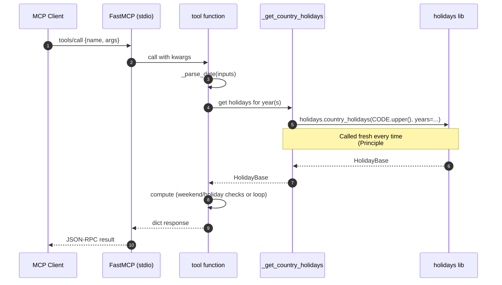
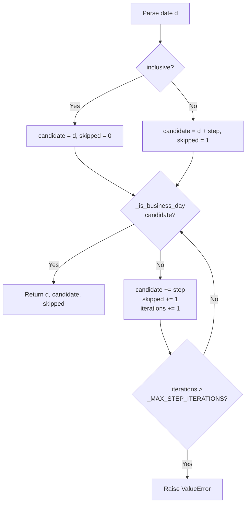
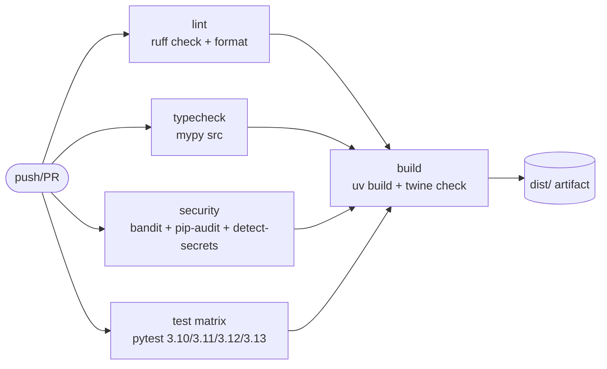
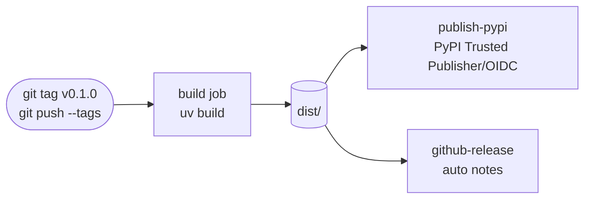

# Workflows

<!-- metadata: scope=workflows, audience=ai-assistants, topic=processes-and-lifecycles -->

## Tool Invocation (Runtime)



Failure mode: any `ValueError` raised inside the tool is serialized by FastMCP as a tool error visible to the client.

## Step-Through Algorithm (`_step_business_day`)

Shared by `next_business_day` (step=+1) and `previous_business_day` (step=-1):



## Range Sweep (`business_days_between`)

1. Parse `start_date`, `end_date`.
2. Validate `start <= end`; validate `end.year - start.year <= _MAX_SPAN_YEARS`.
3. Fetch holidays for the full year range: `list(range(start.year, end.year + 1))`.
4. Compute `last = end - 1 day` (or `end` if `inclusive`).
5. Walk day by day; increment `business_days` on matches; append to `holidays_in_range` for weekday holidays.
6. Return totals plus `calendar_days`.

## Last Business Day of Month

1. Validate `1 <= month <= 12`.
2. Fetch holidays for the year.
3. `last_calendar_day = date(year, month, calendar.monthrange(year, month)[1])`.
4. Walk backward one day at a time until a business day is found. (No upper bound needed — a month has at most 31 days.)

## Local Development Loop

```bash
git clone https://github.com/fbdo/business-day-mcp
cd business-day-mcp
uv sync --all-extras   # installs runtime + dev deps into .venv/
uv run pytest          # runs the suite with the 90% coverage floor
```

Pre-commit is the blessed gate for local changes:

```bash
uv run pre-commit install   # one-time
uv run pre-commit run -a    # lint + format + mypy + bandit + detect-secrets
```

The `uv.lock` file is committed; regenerate only when dependencies change.

## CI Pipeline

File: `.github/workflows/ci.yml`. Triggers: push to `main`, any pull request.



Every job installs deps with `uv sync --all-extras`. The test job additionally installs a matrix-specific Python via `actions/setup-python`.

## Release Pipeline

File: `.github/workflows/publish.yml`. Trigger: tag push matching `v*.*.*`.



Notes:

- PyPI publish uses OIDC — **no API tokens are stored**. The repo must be registered as a PyPI Trusted Publisher before the first tag push (see header comment in `publish.yml`).
- Release notes are auto-generated by `softprops/action-gh-release@v2`.
- Version bumps must update `pyproject.toml` AND `src/business_day_mcp/__init__.py` (`__version__`) in the same commit before tagging.

## Adding a New Tool

1. Define a public function in `server.py` with typed args and a docstring (the docstring becomes the tool description in MCP).
2. Use `_parse_date` for any date arg; raise `ValueError` for validation.
3. Use `_get_country_holidays` for any country arg.
4. Register with `mcp.tool(your_function)` (imperative, not decorator).
5. Add tests in a matching file (new concern) or in an existing `test_*.py`.
6. Reference-date fixtures belong in `tests/conftest.py`.

## Dependency / Tooling Bumps

- Runtime: change `pyproject.toml` `dependencies`, then `uv lock` and `uv sync`.
- Pre-commit hooks: bump `rev:` pins in `.pre-commit-config.yaml`. `mypy` hook also pins runtime deps (`fastmcp`, `holidays`) — keep those aligned with `pyproject.toml`.
- `detect-secrets` baseline: regenerate with `uv run detect-secrets scan > .secrets.baseline` if it flags a change.
